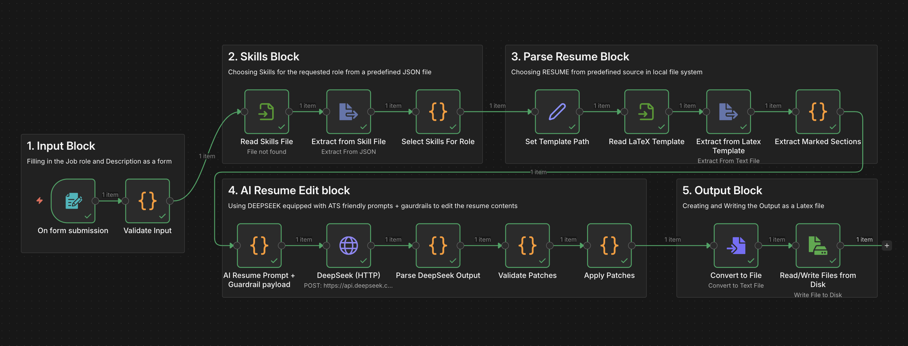
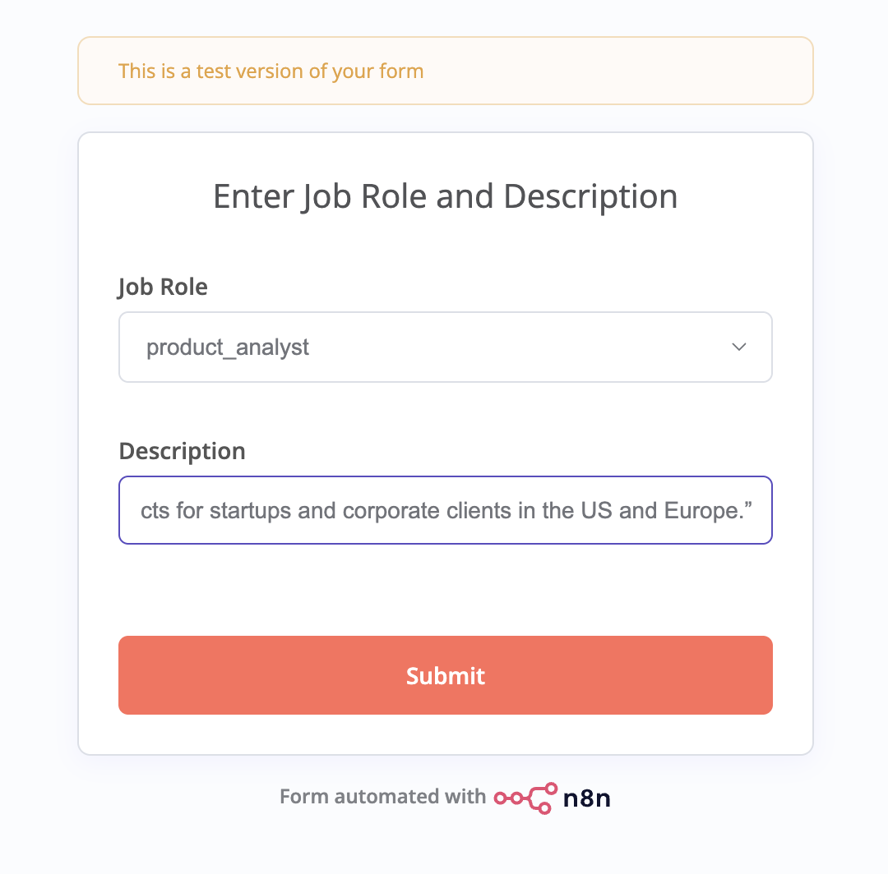

# n8n Resume Editor (LaTeX) . DeepSeek (AI)

A production style n8n workflow that edits LaTeX resumes safely using DeepSeek.
It updates only marked sections in a `.tex` template to match a job description while preserving formatting, macros, and structure.



## What it does
Given:
- a target role (predefined)
- a job description
- a role specific skill checklist
- a LaTeX resume template with markers

The workflow:
1. Loads the correct resume template for the role
2. Extracts marked blocks (LOCATION, SUMMARY, SKILLS, EXPERIENCE, PROJECTS)
3. Calls DeepSeek (OpenAI compatible endpoint)
4. Validates the model output for safety
5. Replaces only the marked blocks
6. Writes a new `.tex` file to output/

## Why this is useful
- Preserves your LaTeX formatting and custom macros
- Prevents the model from changing `\usepackage` or adding new commands
- Produces recruiter ready tailored resumes in seconds

## Tech
- n8n workflow automation
- DeepSeek API (chat completions)
- LaTeX templates with marker based patching
- Validation + guardrails (forbidden tokens, brace balance)

## Repository structure

```text
.
├── workflow/
│   └── resume-editor-deepseek-5blocks.credential-safe.json
│
├── files/
│   └── resumes/
│       ├── templates/
│       │   └── Resumeinlatex.tex
│       │
│       ├── skills/
│       │   └── skills_by_role.json
│       │
│       └── output/
│           └── .gitkeep
│
├── local/
│   ├── docker-compose.yml
│   └── README.md
│
├── docs/
│   ├── demo.md
│   └── screenshots/
│       └── Workflow-n8n.png
│       └── Form-input.png
│
├── README.md
└── LICENSE
```
---

## Required LaTeX markers

Your .tex resume template **must** contain the following markers:

```tex
%=== LOCATION_START ===
...
%=== LOCATION_END ===

%=== SUMMARY_START ===
...
%=== SUMMARY_END ===

%=== SKILLS_START ===
...
%=== SKILLS_END ===

%=== EXPERIENCE_START ===
...
%=== EXPERIENCE_END ===

%=== PROJECTS_START ===
...
%=== PROJECTS_END ===
```
---

## Quickstart

### 1. Start n8n
```cd local```  
```docker compose up -d```

Open n8n at: ```http://localhost:5678```  

### 2. Create the DeepSeek credential
Inside n8n:
 1. Go to Credentials → New
 2. Choose DeepSeek API
 3. Paste your DeepSeek API key and save

### 3. Import the workflow
  Import the workflow JSON: ```workflow/resume-editor-deepseek-5blocks.credential-safe.json```

### 4. Place required files
  Ensure the following files exist inside the mounted folder:
  - ```files/resumes/templates/Resumeinlatex.tex```
  - ```files/resumes/skills/skills_by_role.json```  

Sample versions are included in this repository.

### 5. Run the workflow
1.	Open the workflow in n8n
2.	Click Execute
3.	Fill out the form:
   * Select the job role
   * Paste the job description
5. Submit


### 6. Output
- A new LaTeX file is written to: `files/resumes/output/`
- Filename format: `YYYYMMDD_HHMMSS_<role>.tex`

---

### Example use cases
- Rapid resume tailoring per job posting
- ATS keyword alignment without formatting risk
- Demonstrating safe LLM integration in automation pipelines


### Future Versions
- [ ]PDF compilation using goteberg  
- [ ]Resume vs job description coverage scoring (high level ATS screening)  
- [ ]Multi-template routing  
- [ ]Batch processing mode  
- [x]Parsing it to Auto Job search  
- [ ]Remote Cloud implimentation  
  


